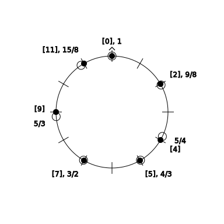

# PitchClock

PitchClock is a Python library for generating 
[tone clocks](https://en.wikipedia.org/wiki/Tone_Clock) for the
visualization of
[Just Intonation](https://en.wikipedia.org/wiki/Just_intonation)
tonal structures.

## Example

As an example, let's compare the equal temperament major scale, 
versus the just intonation scale it approximates, known as the
syntonic scale. Tonal clocks are used for visualizing the 
*relationships*, i.e. the intervals, between the pitches, rather
than the absolute pitches themselves. Thus the typical approach is
to label the pitches with the intervals from the tonic that produce
them, and to place the tonic at the 12 o'clock position. The equal
temperament intervals are represented as the number of half-tones
in the interval, enclosed within square brackets. The just intervals
are represented as whole number frequency ratios. For this graph,
we will mark the equal temperament intervals with filled circles,
the just intervals with outlined circles, and the tonic with an
angle mark. Here's the code to produce the graph:

    from fractions import Fraction
    from pitchclock import ETInterval, ToneClock

    # The equal temperament scale, expressed as equal temperament
    # intervals from the tonic.
    et_major_scale = [ETInterval(s) for s in [0, 2, 4, 5, 7, 9, 11]]
    
    # The just intonation scale, expressed as frequency ratios from 
    # the tonic.
    ji_major_scale = [
        Fraction(*pair) 
        for pair in [(1, 1), (9, 8), (5, 4), (4, 3), (3, 2), (5, 3), (15, 8)]
    ]
    
    # Here we create the clock, indicating which pitches to represent 
    # with each type of marking in the graph. 
    clock = ToneClock(
        filled_dots=et_major_scale, 
        empty_dots=ji_major_scale, 
        angles=[et_major_scale[0], ji_major_scale[0]], 
        labels={p: p for p in et_major_scale + ji_major_scale}
    )
    
    # We make the radius a little bigger because there's a lot going
    # on in this graph. A bigger radius means more space for details.
    clock.style.radius *= 1.5
    
    # Everything is quantized to quarter tones by default, but we are
    # building this graph specifically to compare slight differences
    # in pitch, so we turn it off. However, we leave it on for labels,
    # because otherwise they will overlap for pitches that are very
    # close neighbors. With quantization of labels left on, labels
    # falling within the same quantum will be grouped together with
    # commas to separate them.
    clock.style.quantize_non_labels = False
    
    # Save the clock as a PNG file. Currently, this is the only
    # supported format. 
    clock.save('images/major_comparison.png')

And here's the image it produces:

From this graph, it becomes immediately apparent that the intervals in 
the syntonic scale that are most poorly approximated by the equal
temperament major scale are `5/4`, `5/3`, and `15/8`, each of which
is slightly flatter than the equal temperament pitch used to approximate
it. 
